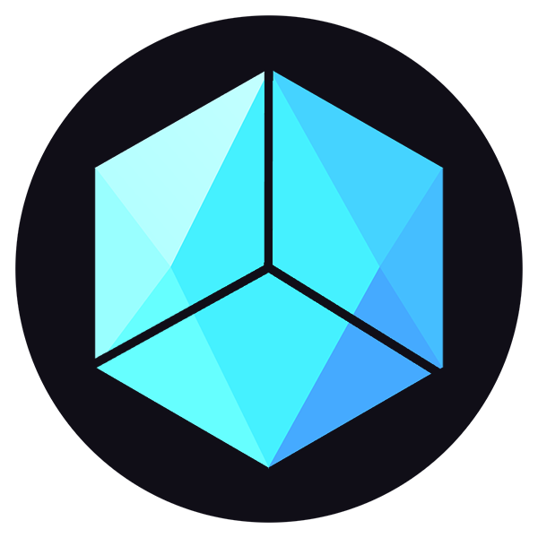
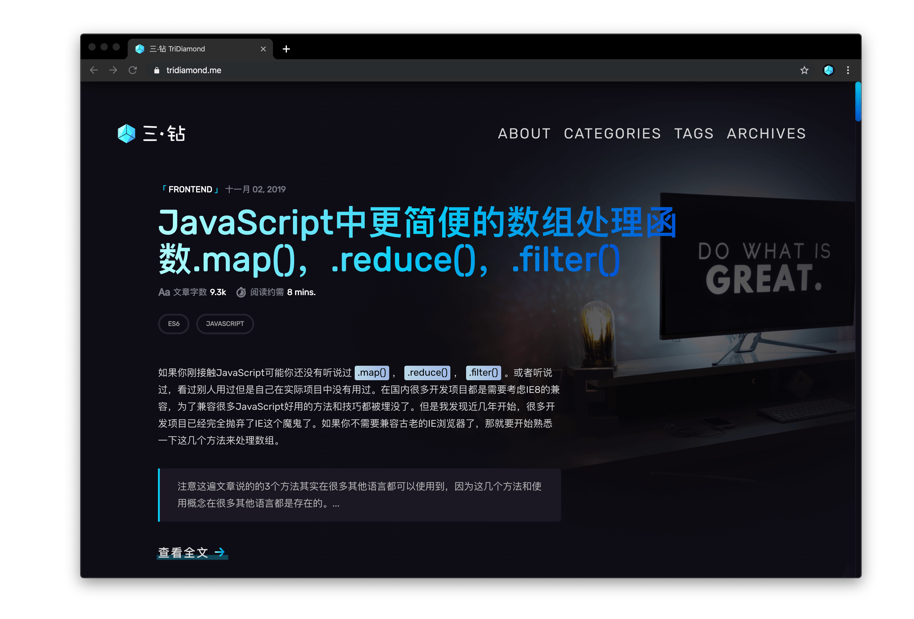
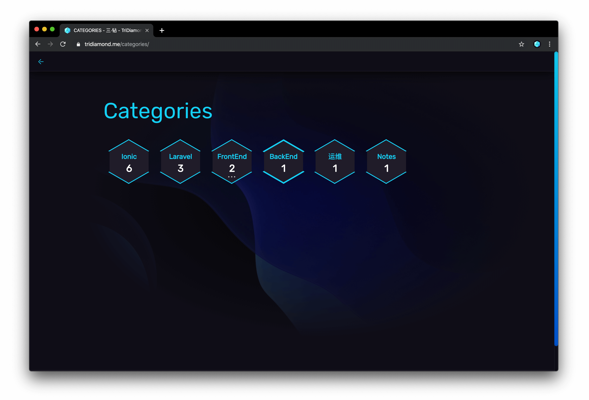
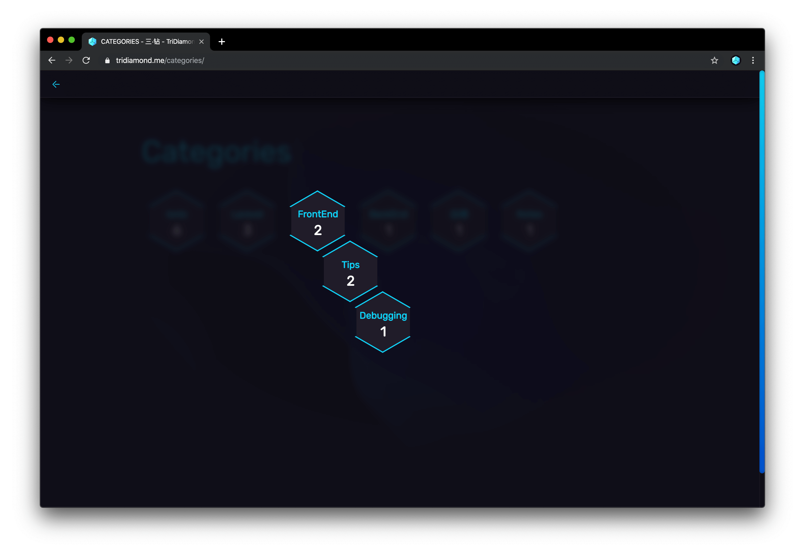
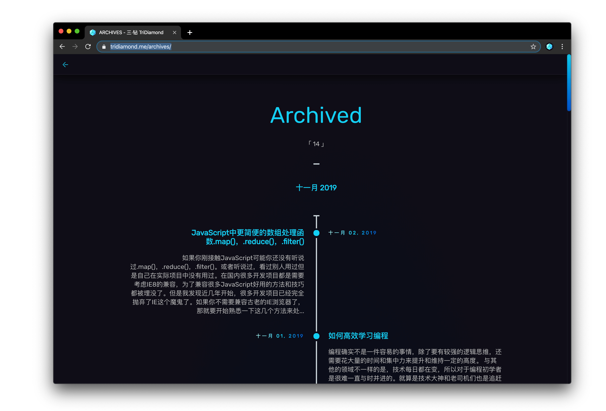
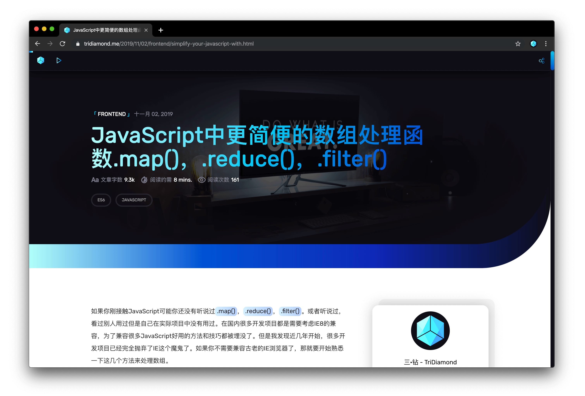

<h1 align="center">Halo Theme: Obsidian</h1>

ᴅᴇsɪɢɴᴇᴅ & ᴄᴏᴅᴇᴅ ʙʏ ᴛʀɪᴅɪᴀᴍᴏɴᴅ  
一款暗色的 Halo 主题, 拥有响应式布局, 简约而优雅.

  
  

**[预览](https://demo.halo.run?preview-theme=halo-theme-obsidian)** | **[更变日志](https://github.com/halo-sigs/halo-theme-obsidian/releases)**

更多主题展示

## 分类页

## 多级分类

## 归档页

## 文章页

## 使用方式

1. 下载，目前提供以下两个下载方式：
    - GitHub Releases：访问 [Releases](https://github.com/halo-sigs/halo-theme-obsidian/releases) 下载 Assets 中的 JAR 文件。
    - Halo 应用市场：<https://halo.run/store/apps/app-ourvb>。
2. 安装，主题安装和更新方式可参考：<https://docs.halo.run/user-guide/themes>。

## 插件支持

为了获得更好的体验，你还可以安装以下插件（如果需要）：

- highlight.js 代码高亮：<https://halo.run/store/apps/app-sqpgf>
- lightgallery.js 灯箱：<https://halo.run/store/apps/app-OoggD>
